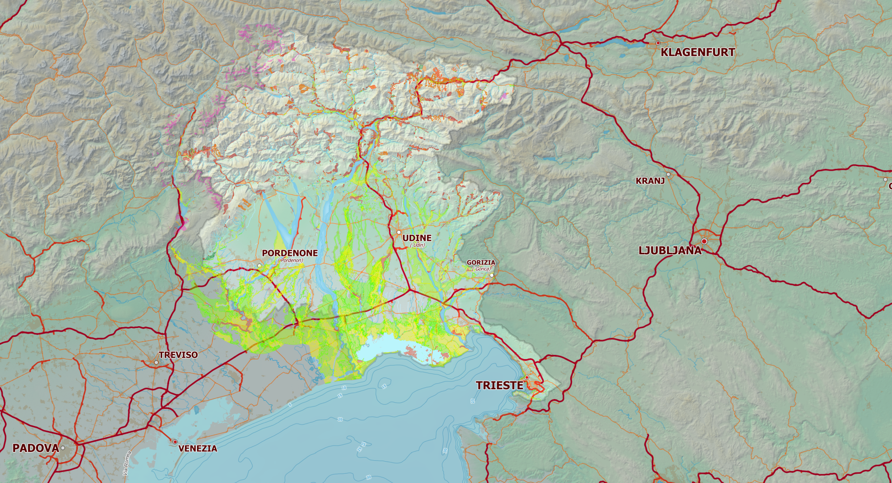
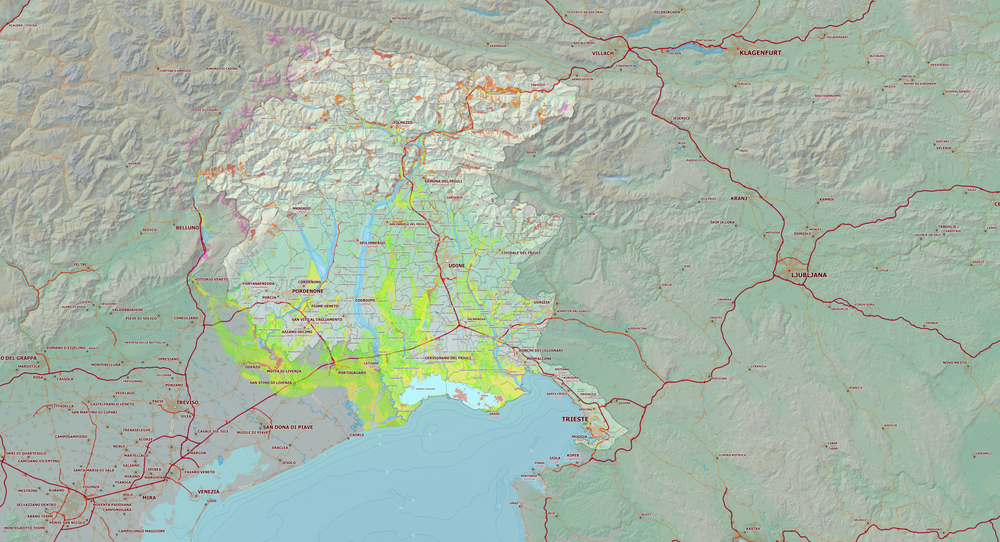

[🇮🇹 Italiano](README.md) | **🇬🇧 English**

# Generating a Multi-Scale COG with PyQGIS and GDAL

*Detailed technical analysis of the Render_Multiscale_Cog_Proc.py script*

Coordinate reference system: EPSG:6708

---

## 1. Introduction

### 1.1 Foreword

What follows is the outcome of numerous failed attempts, repeated until a satisfactory result was achieved, made possible by the decisive collaboration of Claude.ai (Sonnet 4.6). Since this is Python code that has not been reviewed by "expert cooks", you are advised to exercise every caution before using it in production.

### 1.2 Why this is needed

The Render_Multiscale_Cog_Proc.py script addresses a practical problem typical of GIS systems on a local network: a QGIS project made up of dozens of styled vector layers and background rasters is slow to load when the data resides on a network server, because every layer is transferred in full before it can be displayed.

The adopted solution is to pre-render the project into a single raster file structured as a Cloud Optimized GeoTIFF (COG) with internal pyramids generated from real renders at different scales. Unlike standard pyramids — which are simple resamplings (pixel averages) of the base level — the overviews of this COG contain images rendered directly by QGIS at the correct scale, with the appropriate layers active and the data-defined overrides already evaluated.

The COG is used as a cartographic background in the 1:150,000–1:600,000 range. Below 1:150,000 the project loads the original high-resolution layers.
<p align="center">
  <br>
  <em>Figure 1 – Scale 1:600.000</em>
</p>

<p align="center">
  <br>
  <em>Figure 2 – Scale 1:300.000</em>
</p>

<p align="center">
  <br>
  <em>Figure 3 – Scale 1:150.000</em>
</p>


The COG can be thought of as a tile server embedded in the file, with no server involved: GDAL on the client side reads only the 512×512 px blocks needed for the current view through the existing network share, without downloading the whole file. It requires no additional infrastructure beyond an ordinary SMB share.

---

## 2. Pipeline architecture

The pipeline is divided into two distinct phases executed in sequence:

**Phase A — QGIS Processing algorithm (rendering):** run from the QGIS Processing panel. For each of the three scale levels it renders the entire geographic extent into a single image, then crops it into tiles via QImage.copy(). It generates build_cog.bat and inject_ovr.py.

**Phase B — GDAL (assembly):** run in the OSGeo4W Shell. It georeferences the PNG tiles, assembles VRTs, builds the intermediate GeoTIFFs and produces the final COG with real overviews.

```
QGIS Processing algorithm
  ├─ Scale 1:150,000 → render full extent → 36 PNG tiles
  ├─ Scale 1:300,000 → render full extent → 36 PNG tiles
  └─ Scale 1:600,000 → render full extent → 36 PNG tiles
        └─ generates: build_cog.bat  +  inject_ovr.py

OSGeo4W Shell: build_cog.bat
  ├─ [1] gdal_translate  → 108 georeferenced GeoTIFFs
  ├─ [2] gdalbuildvrt    → 3 VRTs (one per scale)
  ├─ [3] gdal_translate  → 3 compressed GeoTIFFs per scale
  └─ [4] inject_ovr.py  → final COG with real overviews
```

The choice to render the entire extent as a single image (rather than tile by tile) is architecturally fundamental: the PAL labeling engine runs only once over the whole area, eliminating at the root any problem of truncated, duplicated or misaligned labels at tile boundaries — regardless of label shape (straight, curved, long).

---

## 3. Configuration parameters

The parameters are exposed in the Processing dialog and require no code changes. The default values cover the typical case of the FVG project.

| Parameter (dialog)              | Type               | Default          | Description                                                                              |
| ------------------------------- | ------------------ | ---------------- | ---------------------------------------------------------------------------------------- |
| Extent reference layer          | Layer (optional)   | —                | The extent() of this layer becomes the rendering area; if empty, the manual field is used |
| Extent (manual)                 | Extent (optional)  | —                | Used only if no reference layer is selected                                              |
| Rendering DPI                   | Integer            | 96               | Render resolution; the m/px resolution is computed automatically from scale and DPI     |
| Tile grid columns / rows        | Integers           | 6 / 6            | Cropping grid: 6×6 = 36 tiles per scale                                                  |
| Include 1:150,000 scale         | Checkbox           | ✓                | Enables the COG base level                                                               |
| Include 1:300,000 scale         | Checkbox           | ✓                | Enables the 2× overview                                                                  |
| Include 1:600,000 scale         | Checkbox           | ✓                | Enables the 4× overview                                                                  |
| Overview scale margin (%)       | Double             | 5.0              | Reduces the effective resolution to anticipate GDAL's overview switching threshold       |
| COG compression algorithm       | Enum               | DEFLATE          | DEFLATE (universal) or ZSTD (faster decompression on LAN)                                |
| Compression level               | Integer            | 9                | 1–9 for DEFLATE, 1–22 for ZSTD                                                           |
| Output folder                   | Folder             | C:\temp\cog\_fvg | Where PNG tiles and intermediate .bat and .py files are saved                            |

The resolution in m/px is no longer an explicit parameter: it is computed automatically at runtime from the nominal scale and the DPI, according to the relation res_m = scale × 0.0254 / dpi. This guarantees that the scale actually rendered always matches the nominal scale of the level, regardless of the chosen DPI.

---

## 4. Reading the layer tree correctly

### 4.1 The problem with mapLayers()

The QgsProject.instance().mapLayers() method returns all layers registered in the project regardless of their visibility. Using it directly includes unwanted layers, ignores disabled layers and does not respect the hierarchical structure of groups.

### 4.2 The solution: walking the QgsLayerTree

The get_layers_at_scale() function recursively walks the layer tree starting from the root. For each node, itemVisibilityChecked() is verified, which corresponds exactly to the checkbox in the Layers panel.

```
def get_layers_at_scale(scala):
    layers = []
    def _collect(node):
        if not node.itemVisibilityChecked():
            return
        if isinstance(node, QgsLayerTreeLayer):
            layer = node.layer()
            if layer and layer.isSpatial():
                if layer.hasScaleBasedVisibility():
                    if layer.isInScaleRange(scala):
                        layers.append(layer)
                else:
                    layers.append(layer)
        elif isinstance(node, QgsLayerTreeGroup):
            for child in node.children():
                _collect(child)
    for child in root.children():
        _collect(child)
    return layers
```

| Method                    | Behavior                                                                          |
| ------------------------- | --------------------------------------------------------------------------------- |
| isVisible()               | Takes into account visibility inherited from parent nodes — does not match the checkbox |
| itemVisibilityChecked()   | Reads exactly the checkbox of the individual node in the Layers panel — correct   |
| hasScaleBasedVisibility() | True if the layer has at least one scale limit configured                         |
| isInScaleRange(scala)     | True if the value falls within the min-max range configured in the layer          |

---

## 5. Expression context and @map_scale

### 5.1 The problem

Data-defined overrides in QGIS use the @map_scale variable to modify symbology or labeling. Without an explicit expression context, @map_scale receives NULL and CASE expressions always execute the ELSE branch — producing, for example, fixed-size labels regardless of scale.

### 5.2 The solution: make_expr_context()

```
def make_expr_context(settings):
    ctx = QgsExpressionContext()
    ctx.appendScope(QgsExpressionContextUtils.globalScope())
    ctx.appendScope(QgsExpressionContextUtils.projectScope(
                        QgsProject.instance()))
    ctx.appendScope(
        QgsExpressionContextUtils.mapSettingsScope(settings))
    return ctx
```

| Scope                      | Variables provided                                   |
| -------------------------- | ---------------------------------------------------- |
| globalScope()              | QGIS global variables (e.g. @qgis\_version)          |
| projectScope(project)      | Project variables (e.g. @project\_title)             |
| mapSettingsScope(settings) | @map\_scale, @map\_extent, @map\_crs, @map\_rotation |

The critical point is that mapSettingsScope(settings) must receive the fully configured QgsMapSettings object — with extent, output size and DPI already set — because the computation of @map_scale depends on these three values.

---

## 6. Single-extent rendering for each scale level

### 6.1 One render per level

For each scale level, the entire geographic extent is rendered into a single QImage, then cropped into 36 tiles via QImage.copy() — a pure pixel-slicing operation, with no additional rendering. This choice is the direct consequence of the problems encountered with per-tile rendering (described in chapter 18): it is the simplest possible solution and structurally eliminates the entire class of problems related to tile boundaries.

```
# Compute the dimensions of the full render
full_px_w = tile_px_w * tile_cols
full_px_h = tile_px_h * tile_rows

# Single render over the whole extent
settings = QgsMapSettings()
settings.setLayers(layers)
settings.setExtent(QgsRectangle(EX_MIN, EY_MIN, EX_MAX, EY_MAX))
settings.setOutputSize(QSize(full_px_w, full_px_h))
settings.setOutputDpi(dpi)

job = QgsMapRendererSequentialJob(settings)
job.start()
job.waitForFinished()
full_img = job.renderedImage().copy()
del job ; gc.collect()

# Crop into tiles: no rendering, just pixel slicing
for row in range(tile_rows):
    for col in range(tile_cols):
        tile_img = full_img.copy(col*tile_px_w, row*tile_px_h,
                                  tile_px_w, tile_px_h)
        tile_img.save(path)
```

### 6.2 QgsMapRendererSequentialJob

Rendering uses QgsMapRendererSequentialJob (instead of the CustomPainterJob used in the early versions) because it renders layers one at a time in the same context, without parallel internal threads. This prevents conflicts on the shared resources of the Qt engine (glyph/font cache of the labeling engine) that caused canvas freezes and missing labels in some levels — problems documented in chapter 18. The resulting image comes directly from renderedImage() without manual QPainter handling.

### 6.3 QgsMapSettings rendering flags

| Flag                            | Effect                                                 |
| ------------------------------- | ------------------------------------------------------ |
| Antialiasing = True             | Smooths the edges of polygons and lines                |
| DrawLabeling = True             | Includes labels in the rendering                       |
| UseAdvancedEffects = True       | Enables transparency, blend modes and layer effects    |
| UseRenderingOptimization = True | Optimizes geometry rendering                           |

### 6.4 Explicit resource disposal

To ensure that each scale level starts from a clean state, job and full_img are explicitly destroyed at the end of each level via del + gc.collect(). This forces the immediate destruction of the underlying C++ objects instead of relying on the Python garbage collector, which might delay it until the next level, propagating residual state between renders.

---

## 7. Generating the GDAL scripts

### 7.1 build_cog.bat — georeferencing and assembly

For each PNG tile, a gdal_translate call is generated with -a_srs to assign the CRS without reprojecting and -a_ullr to georeference using the coordinates of the upper-left and lower-right corners. The georeferenced tiles are assembled into a VRT via gdalbuildvrt and converted into a compressed GeoTIFF.

### 7.2 inject_ovr.py — injecting the pre-rendered overviews

Instead of building pyramids by resampling, this script injects as overviews the GeoTIFFs actually rendered at scales 1:300,000 and 1:600,000. The flow is:

- Open the base file (render_150k.tif) in GA_Update mode

- Call ds.BuildOverviews('AVERAGE', OVR_FACTORS) to create the empty overview structures

- For each level, read the data with ReadAsArray(buf_xsize, buf_ysize) and write it with WriteArray()

- Flush with ds.FlushCache() and final conversion to COG with OVERVIEWS=FORCE_USE_EXISTING

---

## 8. COG optimization parameters

| Parameter            | Value                | Rationale                                                                      |
| -------------------- | -------------------- | ------------------------------------------------------------------------------ |
| COMPRESS             | DEFLATE / ZSTD       | DEFLATE: universal compatibility. ZSTD: faster decompression on a LAN          |
| PREDICTOR            | 2                    | Horizontal differencing: reduces the entropy of Byte RGB data                  |
| ZLEVEL / ZSTD\_LEVEL | 9                    | Maximum compression; read speed is identical to level 1                        |
| BLOCKSIZE            | 512                  | Internal 512×512 px tiles; GDAL reads only the blocks in the current window    |
| NUM\_THREADS         | ALL\_CPUS            | Parallel encoding on all available cores                                       |
| OVERVIEWS            | FORCE\_USE\_EXISTING | Do not recompute the pyramids — use those injected by inject\_ovr.py           |
| OVERVIEW\_COMPRESS   | same as COMPRESS     | Without this parameter the overviews remain uncompressed                       |
| BIGTIFF              | IF\_NEEDED           | Automatically enables the BigTIFF format if the file exceeds 4 GB              |

Note: ZSTD uses the ZSTD_LEVEL parameter (not LEVEL nor ZLEVEL). The presence of ZSTD_LEVEL in the gdal_translate options list confirms that libzstd is correctly linked in the OSGeo4W build.

---

## 9. Partial re-execution of the pipeline

### 9.1 Updating a single scale level

If you change the symbology of layers that are present only at 1:300,000, it is enough to re-run the Processing algorithm with the 1:150,000 and 1:600,000 levels deselected. The script produces the new PNG tiles and regenerates render_300k.tif.

### 9.2 Re-injecting an overview

Re-injecting means replacing the content of an existing overview level with the data of a new pre-rendered GeoTIFF. inject_ovr.py opens the base file in GA_Update, calls BuildOverviews to prepare the structures, overwrites the data with WriteArray and regenerates the final COG with FORCE_USE_EXISTING. The content of the base file (render_150k.tif) is not modified, so the updated COG keeps the 1:150,000 level unchanged.

---

## 10. Using the COG in QGIS

The final COG file can be loaded into QGIS like a normal GeoTIFF via a UNC network path. GDAL automatically handles fetching only the 512×512 px blocks needed for the current view, reducing network traffic compared to loading the original layers.

For correct integration into the project, set scale-dependent visibility on the COG layer:

- Maximum scale (largest): 1:150,000

- Minimum scale (smallest): 1:600,000

---

## 11. Label truncation at tile edges — historical note

In the original version of the algorithm, based on rendering 36 separate tiles per scale level, labels placed near a tile edge were abruptly truncated in the assembled image. The labeling engine anchors the label at the feature point, but the text physically extends beyond the tile's bounding box.

The problem had been addressed with a perimeter buffer: each tile was rendered over an area extended by LABEL_BUFFER_M meters per side, and the resulting image was then cropped to the exact size via QImage.copy(). Calibrating the buffer depended on font size, DPI and resolution in m/px — a parameter to be adjusted manually whenever the DPI changed.

In the current architecture (chapter 6) the problem no longer exists by construction: there are no internal boundaries between tiles during rendering, because the PAL engine runs only once over the whole extent. The LABEL_BUFFER_M parameter has been removed from the dialog. The full historical account of the buffer mechanism is documented in chapter 18.

---

## 12. Results obtained

| Parameter                | Value                                    |
| ------------------------ | ---------------------------------------- |
| Tile grid                | 6×6 = 36 tiles per scale                 |
| Scale levels             | 3 (1:150,000, 1:300,000, 1:600,000)      |
| Total tiles produced     | 108 PNGs                                 |
| Base resolution          | 37.5 m/px (1:150,000)                    |
| Reference system         | Native EPSG:6708, no reprojection        |
| COG file size            | 94 MB                                    |
| Compression              | DEFLATE + PREDICTOR=2 + ZLEVEL=9         |
| Layers included          | 18 styled vector and raster layers       |

---

## 13. COG in QGIS 4.0 — new features and improvements

QGIS 4.0, released on 6 March 2026, represents the most important technical migration since version 3.0: the graphics framework moves from Qt 5 to Qt 6. On the functional side, version 4.0 consolidates and extends native support for the COG format by introducing three specific improvements.

### 13.1 New native Processing algorithm

QGIS 4.0 introduces a dedicated algorithm in the Processing panel — Create Cloud Optimized GeoTIFF — which allows COGs to be created directly from a folder of input rasters, without having to resort to GDAL on the command line. The algorithm supports configuring pyramids, compression type and blocksize directly from the Processing dialog.

Compared to the script illustrated in this article, the native QGIS 4.0 algorithm does not handle multi-scale rendering with pre-rendered overviews: it is suited to converting existing rasters, not to producing COGs from styled QGIS layers. The two solutions are therefore complementary.

### 13.2 Raster export dialog with explicit COG support

The Export Raster and Save As dialogs now include an explicit option for the COG format. In QGIS 3.x, COG export was available only through the GDAL driver by manually selecting the .tif extension and specifying the creation parameters — a non-intuitive procedure. In QGIS 4.0 the user can select COG as the target format with dedicated options for pyramids and compression.

### 13.3 Fix for the -of COG issue on the command line

In QGIS 3.x, when the output format was specified through the file name, the GTiff driver and the COG driver were indistinguishable since both use the .tif/.tiff extension. This caused exports in standard GTiff format when COG was intended. QGIS 4.0 now allows -of COG to be specified explicitly in Processing operations that accept GDAL flags, eliminating this ambiguity.

### 13.4 COG support in QGIS 3.x — current status

For completeness: read support for COGs has been present in QGIS since version 3.2 through GDAL. GDAL's COG driver automatically handles block-wise reading and overview caching. The script presented in this article is therefore fully operational on QGIS 3.x (tested on 3.40 LTR) and does not require QGIS 4.0 for rendering or for generating the GDAL scripts.

---

## 14. Qt6 compatibility — changes for QGIS 4.0

The migration from Qt5 to Qt6 entails a few changes to the Python code. The QGIS team provides a compatibility shim (qgis.PyQt) that makes it possible to write code compatible with both versions through minimal changes.

### 14.1 Imports via the qgis.PyQt shim

The main change is to replace direct imports from PyQt5 with the qgis.PyQt proxy, which automatically redirects to PyQt5 or PyQt6 depending on the QGIS environment:

```
# Compatible with Qt5 (QGIS 3.x) and Qt6 (QGIS 4.x)
from qgis.PyQt.QtCore import QSize, QCoreApplication, QT_VERSION_STR

# Version detection for conditional enum logic
IS_QT6 = int(QT_VERSION_STR.split('.')[0]) >= 6
```

In the current algorithm QImage and QPainter are no longer imported directly: rendering uses QgsMapRendererSequentialJob, which returns the image via renderedImage() without requiring manual QPainter handling.

### 14.2 Fully qualified enums in Qt6

Qt6 requires enums to be fully qualified. The IS_QT6 pattern solves the problem in a single line for all QgsMapSettings flags:

```
_FLAGS = QgsMapSettings.Flag if IS_QT6 else QgsMapSettings

settings.setFlag(_FLAGS.Antialiasing,            True)
settings.setFlag(_FLAGS.DrawLabeling,             True)
settings.setFlag(_FLAGS.UseAdvancedEffects,       True)
settings.setFlag(_FLAGS.UseRenderingOptimization, True)
```

### 14.3 Compatibility summary

| Component            | QGIS 3.40 LTR     | QGIS 4.0                  | Action required                |
| -------------------- | ----------------- | ------------------------- | ------------------------------ |
| QtCore import        | from PyQt5.QtCore | from qgis.PyQt.QtCore     | Use qgis.PyQt everywhere       |
| QgsMapSettings flags | unqualified       | QgsMapSettings.Flag.\*    | Use \_FLAGS = ... if IS\_QT6   |
| qgis.core API        | unchanged         | unchanged (2.x deprecated) | No changes                    |
| osgeo / GDAL         | unchanged         | unchanged                 | No changes                     |
| Processing algorithm | compatible        | compatible                | No changes                     |

---

## 15. Results and final considerations

| Parameter                   | Value                                               |
| --------------------------- | --------------------------------------------------- |
| Renders per scale level     | 1 (full extent, then cropped into tiles)            |
| Tile grid                   | 6×6 = 36 tiles per scale (cropped from single render) |
| Scale levels                | 3 (1:150,000, 1:300,000, 1:600,000)                 |
| Total tiles produced        | 108 PNGs                                            |
| Reference system            | Native EPSG:6708 — no label distortion              |
| COG file size               | 94 MB                                               |
| Compression                 | DEFLATE/ZSTD + PREDICTOR=2, LEVEL=9 (COG driver)    |
| Layers included             | 18 styled vector and raster layers                  |
| Rendering engine            | QgsMapRendererSequentialJob + FlagNoThreading       |
| Compatibility               | QGIS 3.40 LTR and QGIS 4.0 with no code changes     |

---

## 16. Processing algorithm — current version

The algorithm appears in the QGIS Processing panel under Scripts → GISDIS FVG → Render Multi-Scala → COG. It can be invoked like any native tool, including use in graphical models (Graphical Modeler) and in batch via qgis_process.

### 16.1 Structure of the QgsProcessingAlgorithm class

A QgsProcessingAlgorithm requires the implementation of a minimum set of mandatory methods, in addition to the application logic:

| Method                 | Role                                                                           |
| ---------------------- | ------------------------------------------------------------------------------ |
| name() / displayName() | Internal identifier and display name in the Processing panel                   |
| group() / groupId()    | Grouping category (e.g. "GISDIS FVG")                                          |
| flags()                | FlagNoThreading: forces execution on the GUI thread — required for Qt rendering |
| shortHelpString()      | HTML text shown in the dialog's help panel                                     |
| initAlgorithm()        | Defines the parameters that generate the dialog controls                       |
| processAlgorithm()     | Contains the rendering, cropping and GDAL script generation logic              |

### 16.2 Dialog parameters (current version)

| Parameter class                         | Generated widget   | Current use                                                                          |
| --------------------------------------- | ------------------ | ------------------------------------------------------------------------------------ |
| QgsProcessingParameterFolderDestination | Folder selector    | Output folder for PNG tiles and GDAL scripts                                         |
| QgsProcessingParameterMapLayer (opt.)   | Layer selector     | Reference layer for the extent — its extent() becomes the rendering area             |
| QgsProcessingParameterExtent (opt.)     | Map selector       | Manual extent, used only if no reference layer is selected                           |
| QgsProcessingParameterNumber (DPI)      | Integer spinbox    | Rendering DPI; res\_m computed automatically from scale and DPI                      |
| QgsProcessingParameterNumber (grid)     | Integer spinbox    | Columns and rows of the cropping grid (default 6×6)                                  |
| QgsProcessingParameterBoolean (×3)      | Checkbox           | Inclusion of the 1:150k, 1:300k, 1:600k levels                                       |
| QgsProcessingParameterNumber (margin)   | Double spinbox     | Overview scale margin in % to anticipate GDAL's switching threshold                  |
| QgsProcessingParameterEnum              | Drop-down menu     | COG compression algorithm: DEFLATE or ZSTD                                           |
| QgsProcessingParameterNumber (level)    | Integer spinbox    | Compression level (1–9 for DEFLATE, 1–22 for ZSTD)                                   |

The extent from a reference layer (QgsProcessingParameterMapLayer) replaces the earlier mechanisms based on setting the canvas scale — which interfered with QGIS's internal rendering job and blocked its response to commands. layer.extent() does not touch the canvas in any way, eliminating this class of problems.

### 16.3 FlagNoThreading — why it is needed

By default QGIS runs Processing algorithms on a separate worker thread. This script uses QgsMapRendererSequentialJob, which interacts with the Qt rendering engine (glyph/font cache, paint engine): running it in the background can corrupt resources shared with the GUI thread. FlagNoThreading forces synchronous execution on the main thread:

```
def flags(self):
    return super().flags() | QgsProcessingAlgorithm.FlagNoThreading
```

### 16.4 Diagnostic log

The algorithm produces a detailed log for each scale level, useful for diagnosing configuration problems without having to open the properties of each layer:

- Layers visible at this scale (name and presence of label scale limits)

- [label-scale] — label visibility range for each vector layer; reports whether the range excludes the current scale

- [label-size] — font size computed for data-defined expressions based on @map_scale; reports size=0, which would make the label invisible

- Actual QGIS scale and @map_scale — confirms that the nominal scale and the rendered one coincide

### 16.5 Installation

```
Processing → Options → General settings
  → Additional script folders → [add folder]

or copy to:
%APPDATA%\QGIS\QGIS3\profiles\default\processing\scripts\

Then: Processing → Processing Tools → Scripts
  → right-click → "Load script from file"
```

---

## 17. The LEVEL parameter for the COG driver

While running build_cog.bat, the warning 'ZLEVEL creation option not supported' appeared. The cause is an inconsistency between distinct GDAL drivers: the GTiff driver uses ZLEVEL for DEFLATE and ZSTD_LEVEL for ZSTD, whereas the COG driver uses a unified parameter — LEVEL — valid for all compression algorithms.

| Target driver                           | DEFLATE parameter | ZSTD parameter |
| --------------------------------------- | ----------------- | -------------- |
| GTiff (intermediate render\_XXXk.tif files) | ZLEVEL        | ZSTD\_LEVEL    |
| COG (final file — inject\_ovr.py)       | LEVEL             | LEVEL          |

The fix replaces the conditional parameter in inject_ovr.py with the unified value:

```
# BEFORE — generates a warning on the COG driver
creationOptions = [f"{comp_level_param}={comp_level}", ...]

# AFTER — correct for the COG driver
creationOptions = ["LEVEL={comp_level}", ...]
```

---

## 18. Architectural evolution: from per-tile rendering to single-extent rendering

The previous chapters document the original architecture, based on 36 renders per scale level (one per tile) with a perimeter buffer for straight labels and a two-pass approach for curved labels. This architecture, tested in daily use, revealed two structural issues that required a radical revision, described in this chapter.

### 18.1 Limits of the per-tile approach with buffer and two-pass rendering

The first problem concerned QgsMapRendererCustomPainterJob, used for each of the 108 renders (36 tiles × 3 scales). This class internally starts worker threads for rendering individual layers — behavior inherited from the canvas's own rendering engine. Running 108 jobs in sequence without explicitly destroying the underlying C++ objects left Qt rendering engine resources (glyph/font cache, paint engine) in a not fully disposed state between one job and the next. The observed symptom was a QGIS canvas freeze at the end of the script — zoom and F5 stopped responding — which survived even closing the project, a sign that the corruption occurred at process level and not at the level of a single QGIS project.

The second problem concerned the two-pass mechanism for curved labels, based on QgsNullSymbolRenderer to temporarily isolate labels alone in a separate global render. In some cases this produced completely empty tiles except for the labels — a symptom of an unexpected interaction between the renderer replacement and the lifecycle of layer objects during asynchronous rendering.

### 18.2 New architecture: one render per scale level

The adopted solution eliminates both problems at the root: instead of 36 renders per level with buffer and two-pass, the entire geographic extent is rendered into a single image for each of the three scale levels, and only afterwards is this image cropped into tiles via QImage.copy() — a pure pixel-slicing operation, with no additional rendering.

```
# Render of the whole extent (once per level)
settings = QgsMapSettings()
settings.setLayers(layers)
settings.setExtent(QgsRectangle(EX_MIN, EY_MIN, EX_MAX, EY_MAX))
settings.setOutputSize(QSize(full_px_w, full_px_h))
# ... rendering (see 18.3) ...

# Crop into tiles: no additional rendering
for row in range(tile_rows):
    for col in range(tile_cols):
        px_x, px_y = col * tile_px_w, row * tile_px_h
        tile_img = full_img.copy(px_x, px_y, tile_px_w, tile_px_h)
        tile_img.save(path)
```

This architecture makes both truncation and duplication of labels at tile edges structurally impossible, whatever their shape (straight, curved, long): the PAL (Placement Algorithm) engine runs only once over the whole extent, and the subsequent cropping does not alter in any way the text already placed — it simply cuts pixels, without recomputing the layout.

### 18.3 QgsMapRendererSequentialJob instead of CustomPainterJob

The single-extent render uses QgsMapRendererSequentialJob instead of QgsMapRendererCustomPainterJob. The substantial difference is that layers are rendered one at a time in the same context, rather than in parallel on separate per-layer threads — eliminating the thread contention on the shared resources of the rendering engine that caused the canvas freeze. The API is also simpler: the image comes directly from renderedImage(), without manual QPainter handling.

```
job = QgsMapRendererSequentialJob(settings)
job.start()
job.waitForFinished()

errors = job.errors()
if errors:
    for err in errors:
        feedback.pushWarning(f'Errore layer "{err.layerId}": {err.message}')

full_img = job.renderedImage().copy()  # copy independent of the job
```

The job.errors() check is an additional diagnostic introduced at this stage: it exposes in the log any per-layer rendering errors, useful for spotting data or style problems without having to manually inspect each layer.

### 18.4 Forced execution on the main GUI thread

By default QGIS runs Processing algorithms on a worker thread separate from the main GUI thread. The flags() method is overridden to explicitly declare FlagNoThreading, forcing synchronous execution on the GUI thread — the correct behavior for algorithms that perform direct rendering:

```
def flags(self):
    return super().flags() | QgsProcessingAlgorithm.FlagNoThreading
```

It should be stressed that this change alone was not enough to solve the canvas freeze: the real problem concerned the internal threads spawned by CustomPainterJob for rendering individual layers, not the thread on which processAlgorithm() runs. The combination of FlagNoThreading with QgsMapRendererSequentialJob (18.3) is the complete solution: the former guarantees a predictable execution context, the latter eliminates the underlying cause of the thread conflict.

### 18.5 Explicit resource disposal between levels

To ensure that each scale level starts from a clean state, rendering objects are explicitly destroyed at the end of each level, instead of relying only on Python's automatic garbage collector — which might delay the destruction of the underlying C++ objects until after the next level has started:

```
del job
gc.collect()
# ... tile rendering ...
del full_img, settings
gc.collect()
```

### 18.6 Parameters that have become structurally superfluous

With the single-extent architecture, two parameters of the previous version were removed because the problem they tried to solve can no longer occur: LABEL_BUFFER_PX (the perimeter buffer to avoid truncating labels at tile edges) and GLOBAL_LABEL_LAYERS (the selection of layers to be handled with the separate global render for curved labels). There are no longer internal boundaries between renders: the PAL engine always works on the whole extent, so there is nothing to buffer or to isolate in a separate pass.

---

## 19. Extent from a reference layer

An independent revision concerned the way the script determines the geographic area to render, replacing direct interaction with the QGIS canvas with a mechanism that does not depend in any way on the graphical interface.

### 19.1 The problem of setting the scale on the canvas

An intermediate version of the script automatically set the canvas scale to 1:600,000 via canvas.zoomScale() and read the resulting extent, to spare the user from manually selecting coordinates. Although the main cause of the canvas freeze later turned out to be CustomPainterJob (chapter 18.1), the zoomScale()-based approach remained fragile for other reasons: it requires the iface object, which is not available in headless execution (for example via qgis_process from the command line), and it introduces an unnecessary dependency on the graphical interface for a conceptually simple operation such as determining a geographic extent.

### 19.2 Solution: selecting a reference layer

The adopted mechanism entirely replaces the interaction with the canvas with a QgsProcessingParameterMapLayer parameter: the user selects a project layer (typically an administrative boundary or a dedicated mask), and its extent() becomes the rendering area:

```
self.addParameter(QgsProcessingParameterMapLayer(
    self.EXTENT_LAYER,
    'Layer di riferimento per l\'estensione (opzionale)',
    optional=True
))

extent_layer = self.parameterAsLayer(
    parameters, self.EXTENT_LAYER, context)
if extent_layer is not None:
    ext     = extent_layer.extent()
    ext_crs = extent_layer.crs()
else:
    # falls back to the manual Extent parameter
    ext     = self.parameterAsExtent(parameters, self.EXTENT, context)
    ext_crs = self.parameterAsExtentCrs(parameters, self.EXTENT, context)
```

This removes any dependency on iface and on the canvas, making the script run identically from the interactive dialog, from a Graphical Modeler model, or from the headless command line.

---

## 20. Diagnosing and fixing label scale-dependency

During tuning, it emerged that some labels were missing at specific scales even though the layers were correctly included in the rendering. The diagnosis required distinguishing two conceptually separate QGIS mechanisms, both scale-based but independent of each other.

### 20.1 Two distinct scale controls in QGIS

The first mechanism is layer visibility by scale (hasScaleBasedVisibility / isInScaleRange), already handled by get_layers_at_scale since the earliest versions of the script: if the layer is out of range, the entire layer — symbology and labels together — is excluded from rendering.

The second mechanism, distinct and independent, is the scale-dependency configured inside the layer's labeling properties (Rendering tab of the Labels panel in QGIS): a scale range that limits only the visibility of labels, leaving the layer's symbology always present. If this range excludes the current scale, the layer appears normally on the map but without text — exactly the observed symptom, and indistinguishable at first sight from other possible causes.

### 20.2 relax_label_scale_visibility()

This function detects, for each layer and for each rule of any rule-based labeling (QgsRuleBasedLabeling, traversed recursively), whether the labels' scale-dependency excludes the current scale; if so, it temporarily disables it for the duration of the render, restoring it immediately afterwards in a finally block:

```
def relax_label_scale_visibility(layers_list, feedback, scala):
    saved = []
    for layer in layers_list:
        if not isinstance(layer, QgsVectorLayer):
            continue  # raster layers have no labeling
        labeling = layer.labeling()
        if labeling is None:
            continue
        for rule, settings in _iter_label_settings(labeling):
            if not settings.scaleVisibility:
                continue
            smin, smax = settings.minimumScale, settings.maximumScale
            in_range = not ((smin and scala > smin) or
                            (smax and scala < smax))
            feedback.pushInfo(f'[label-scale] {layer.name()}:
                range 1:{smax:.0f}-1:{smin:.0f}  
                {"dentro" if in_range else "FUORI"} a 1:{scala:,}')
            if not in_range:
                settings.scaleVisibility = False
                # ... apply and record for restoration ...
```

An initial bug in this function tried to call layer.labeling() indiscriminately on all layers, including rasters (for example the project's DEM), which do not have this method — causing an AttributeError that interrupted execution. The fix, shown in the code above, prepends an isinstance(layer, QgsVectorLayer) check.

### 20.3 diagnose_label_size_expression() and the caveat on feature fields

Besides the on/off scale-dependency, labels can have a font size controlled by a data-defined expression based on @map_scale, capable of returning 0 — an invisible label — without any flag signaling it. This function evaluates the expression using the current render's context, reporting the computed value:

```
dd = settings_obj.dataDefinedProperties()
prop = dd.property(_PAL_PROPS.Size)
if prop is not None and prop.isActive():
    val, ok = prop.value(expr_context, None)
```

A first version of this diagnostic produced a misleading result for the places layer: that layer's expression depends on the population field, not on @map_scale, and when evaluated without a concrete feature in the context the field was NULL, making the CASE collapse to the default value set in the call — wrongly read as "computed size 0". The fix determines beforehand, via QgsExpression(expr_str).referencedColumns(), whether the expression depends on feature fields: if so, it explicitly reports that the value cannot be reliably evaluated without a concrete feature, instead of presenting a potentially wrong number.

### 20.4 Case study: analysis of the places layer style

Direct inspection of the places layer's QML style file made it possible to examine the underlying XML configuration and confirm that it was not the cause of the observed problem. The relevant properties — "scaleVisibility=1" with a 1:50,000–1:1,000,100 range for the labels, and a font size expression based on the population field with a minimum value of 8 (never zero) — showed that the layer should have displayed labels correctly at all three target scales. This analysis made it possible to rule out places and steer the diagnosis toward other layers and, finally, toward the root cause described in the next chapter.

---

## 21. Root cause: effective scale different from nominal scale

The fixes of chapters 18-20, although necessary and correct, were not sufficient to explain one specific symptom: the labels of some layers were missing only at the 1:600,000 level, even though they were visible at both 1:150,000 and 1:300,000, and even though they were also visible in QGIS's interactive canvas when manually set to that same scale.

### 21.1 The symptom in the diagnostic log

The investigation examined the rendering log of the "600k" level, spotting a revealing line:

```
Scala QGIS: 1:883896 | @map_scale=883895.9854014597
```

The level nominally "1:600,000" was actually rendering at scale 1:883,896 — a 47% deviation. This explains the entire class of observed symptoms: the label scale limits and @map_scale-based expressions in the project are calibrated on round nominal thresholds, whereas the scale actually used during the render was well beyond those thresholds; in the interactive canvas, by contrast, the displayed scale is always the actual, correct one.

### 21.2 Cause: fixed resolution calibrated for a single DPI

The cause lay in the RES_150K, RES_300K and RES_600K parameters (resolution in m/px), fixed values calibrated for 96 DPI in the script's initial design. The correct relation between scale, resolution and DPI is:

```
scale = res_m × dpi / 0.0254
```

If the DPI set in the dialog differs from 96 — in the diagnosed case, 150 — the same fixed resolution in m/px corresponds to a different scale. With res_m=150 and dpi=150: scale = 150 × 150 / 0.0254 ≈ 885,827, consistent with the observed 884k up to rounding on the tile pixels.

### 21.3 Fix: dynamic resolution computation

The fix eliminates the very possibility of the error: instead of a fixed resolution value independent of the DPI, res_m is computed at runtime from the nominal scale and the current DPI, guaranteeing that the scale actually rendered always coincides exactly with the nominal one:

```
M_PER_INCH = 0.0254

for include_key, scala, tag, ovr in [
    (self.INCLUDE_150K, 150_000, '150k', 1),
    (self.INCLUDE_300K, 300_000, '300k', 2),
    (self.INCLUDE_600K, 600_000, '600k', 4),
]:
    if self.parameterAsBool(parameters, include_key, context):
        res_m = scala * self.M_PER_INCH / dpi
        scale_levels.append({'scala': scala, 'res_m': res_m, ...})
```

### 21.4 Simplifying the dialog

A direct consequence of the fix is the removal of the three numeric resolution parameters (RES_150K, RES_300K, RES_600K) from the Processing dialog: since there is no longer any value to calibrate manually, only the three checkboxes to include or exclude each scale level remain. This structurally eliminates an entire class of configuration errors, in addition to simplifying the interface.

---

## 22. Tolerance margin for overview selection

Once the effective scale of each level was corrected, one last detail emerged, related not to the content of the renders but to how GDAL and QGIS decide which COG overview to show during interactive navigation.

### 22.1 Overview selection behavior in GDAL

When QGIS displays a COG raster, for each zoom level it computes the resolution required by the current view and selects the overview whose resolution is the closest without being coarser than necessary. This selection mechanism does not trigger exactly at an overview's nominal scale, but only after the view exceeds it by a tolerance margin intrinsic to the algorithm — in the observed case, the switch from the 1:300,000 overview to the 1:600,000 one occurred when navigating up to about 1:630,000, rather than exactly at 1:600,000.

It is important to stress that this is not a defect of the rendering pipeline: the content of the "600k" level is correctly rendered at the exact 1:600,000 scale (chapter 21); the margin concerns exclusively the threshold with which the viewer decides when to show that content rather than the previous one.

### 22.2 The SCALE_MARGIN_PCT parameter

To compensate for this intrinsic margin, a parameter was introduced that slightly reduces only the effective resolution of each level — not the nominal scale used for labeling and diagnostics — moving the viewer's switching threshold closer to the desired nominal scale:

```
margin_factor = 1.0 - (margin_pct / 100.0)   # default: 5%
res_m = scala * margin_factor * self.M_PER_INCH / dpi
```

The distinction between nominal scale (used by get_layers_at_scale, relax_label_scale_visibility, diagnose_label_size_expression and by the file names) and effective resolution (on which the margin acts) is intentional: all visibility and labeling decisions remain anchored to the round nominal value (150,000/300,000/600,000), while only the physical detail of the render is slightly refined. The secondary consequence — the true scale reported in the log for the render will be slightly lower than the nominal one, for example 1:570,000 instead of 1:600,000 with a 5% margin — falls well within the tolerance margins already observed in the project's label-scale thresholds (on the order of hundreds of thousands), and does not compromise their correct evaluation. Setting the parameter to 0 restores behavior identical to a computation without margin.

---

## 23. Final architectural state and results

The tuning process described in chapters 18-22 led the algorithm to an architecture that is substantially simpler and more robust than the original: one render per scale level instead of thirty-six, no perimeter buffer, no two-pass mechanism, no dependency on the QGIS canvas, and a mathematically exact relationship between nominal scale, resolution and DPI.

| Parameter                   | Current value                                                       |
| --------------------------- | ------------------------------------------------------------------- |
| Renders per scale level     | 1 (full extent, then cropped into tiles)                            |
| Scale levels                | 3, independently selectable (1:150k, 1:300k, 1:600k)                |
| Rendering engine            | QgsMapRendererSequentialJob + FlagNoThreading                       |
| Extent                      | from reference layer (QgsProcessingParameterMapLayer) or manual     |
| Resolution per level        | computed from nominal scale and DPI (never a fixed value)           |
| Overview margin             | configurable percentage, default 5%, can be disabled with 0         |
| Label buffer at edges       | no longer needed — no internal boundaries between renders           |
| Curved label handling       | no longer needed — a single render for the whole extent             |
| Label-scale diagnostics     | relax\_label\_scale\_visibility + diagnose\_label\_size\_expression |
| Compatibility               | QGIS 3.40 LTR and QGIS 4.0 (Qt5/Qt6) with no code changes           |

The resulting COG file, generated with this architecture, retains all the optimization characteristics described in the initial chapters — DEFLATE/ZSTD compression, real pyramids built from actual renders rather than simple resampling, a compact size under 100 MB for the entire Friuli Venezia Giulia area — while resolving, structurally rather than correctively, all the classes of problems that emerged in daily use: canvas freezes, truncated or duplicated labels at boundaries, and labels missing because of a mismatch between nominal and effective scale.

---

## Appendix: dependencies and versions

- QGIS 3.40 LTR or QGIS 4.0, built-in Python 3.x

- qgis.core: QgsMapRendererSequentialJob, QgsMapSettings, QgsProject, QgsRectangle, QgsLayerTreeLayer, QgsLayerTreeGroup, QgsExpressionContext, QgsExpressionContextUtils, QgsVectorLayer, QgsRuleBasedLabeling, QgsPalLayerSettings, QgsExpression, QgsCoordinateTransform

- qgis.core (Processing): QgsProcessing, QgsProcessingAlgorithm, QgsProcessingParameterMapLayer, QgsProcessingParameterExtent, QgsProcessingParameterFolderDestination, QgsProcessingParameterNumber, QgsProcessingParameterBoolean, QgsProcessingParameterEnum, QgsProcessingException

- qgis.PyQt.QtCore: QSize, QCoreApplication, QT_VERSION_STR (Qt5/Qt6 compatible in QGIS 4.0)

- GDAL 3.x in OSGeo4W Shell: gdal_translate, gdalbuildvrt, gdal.Open, gdal.Translate

- Python standard library: os, math, gc, statistics (benchmark), time (benchmark)

---

## Bibliography and references

### Standards and specifications

**[1]** Open Geospatial Consortium (2023). OGC Cloud Optimized GeoTIFF Standard, Version 1.0. OGC Document 21-026. Available at: <https://docs.ogc.org/is/21-026/21-026.html>

**[2]** cogeotiff/cog-spec (2023). Cloud Optimized GeoTIFF Specification. GitHub Repository. Available at: <https://github.com/cogeotiff/cog-spec>

### GDAL and QGIS technical documentation

**[3]** GDAL Development Team (2024). COG — Cloud Optimized GeoTIFF Generator. GDAL Documentation. Available at: <https://gdal.org/drivers/raster/cog.html>

**[4]** QGIS Development Team (2026). Changelog for QGIS 4.0 — Norrköping. Released: 6 March 2026. Available at: <https://changelog.qgis.org/en/version/4.0/>

**[5]** QGIS Development Team (2025). Plugin migration to be compatible with Qt5 and Qt6. QGIS Wiki. Available at: <https://github.com/qgis/QGIS/wiki/Plugin-migration-to-be-compatible-with-Qt5-and-Qt6>

**[6]** QGIS Plugin Repository (2026). Migrate Your Plugin to QGIS 4. Available at: <https://plugins.qgis.org/docs/migrate-qgis4>

### Guides and technical articles

**[7]** Alberti, K. (2021). GeoTIFF Compression Optimization Guide. Kokoalberti.com. Available at: <https://kokoalberti.com/articles/geotiff-compression-optimization-guide/>

**[8]** Cloud-Native Geo Community (2024). Cloud-Optimized GeoTIFFs — Cloud-Optimized Geospatial Formats Guide. Available at: <https://guide.cloudnativegeo.org/cloud-optimized-geotiffs/intro.html>

**[9]** cogeo.org (2024). Cloud Optimized GeoTIFF — Ecosystem and Tools Overview. Available at: <https://cogeo.org/>

### Scientific publications

**[10]** Friess, M. et al. (2023). COMTiles: A Case Study of a Cloud Optimized Tile Archive Format. ISPRS Archives of the Photogrammetry, Remote Sensing and Spatial Information Sciences, Volume XLVIII-4/W7-2023. FOSS4G 2023, Prizren. DOI: 10.5194/isprs-archives-XLVIII-4-W7-2023

**[11]** Milani, E. et al. (2024). A computational framework for processing time-series of earth observation data based on discrete convolution: global-scale historical Landsat cloud-free aggregates at 30 m spatial resolution. PLOS ONE / PMC. Available at: <https://www.ncbi.nlm.nih.gov/pmc/articles/PMC11624844/>

**[12]** Kowalski, D. et al. (2025). Optimizing Cloud-to-GPU Throughput for Deep Learning With Earth Observation Data. arXiv. Available at: <https://arxiv.org/abs/2506.06235>
